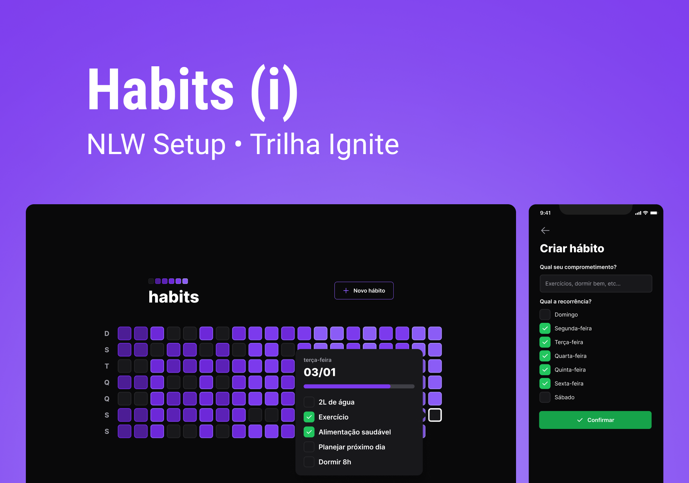

<h1 align="center"> NLW-SETUP </h1>

Projeto realizado durante a NLW-SETUP

## 🚀 Tecnologias

Este projeto foi desenvolvido com as seguintes tecnologias:

- Web
  * [React](https://pt-br.reactjs.org/)
  * [Radix](https://www.radix-ui.com/)
  * [Tailwind](https://tailwindcss.com/)
  * [Axios](https://axios-http.com/ptbr/docs/intro)
  
- Back-end
  * [Fastify](https://www.fastify.io/)
  * [Prisma](https://www.prisma.io/)
  * SQLite
  
- Mobile
  * [Expo](https://expo.dev/)
 
- Typescript
- [Node e NPM](https://nodejs.org/)
 
## 💻 Projeto

O projeto consiste em uma aplicação com versão Web e Mobile para criar e gerenciar listas de hábitos
onde você pode:

* Criar um ou mais hábitos para um dia
* Visualizar os hábitos do dia
* Marcar e desmarcar um hábito criado como concluído

## 🔖 Layout

Você pode visualizar o layout do projeto através [DESTE LINK](https://www.figma.com/community/file/1195326661124171197).   
* É necessário ter uma conta no [Figma](https://figma.com) para acessá-lo.

---

Feito com ♥ by Rocketseat :wave: [Participe da nossa comunidade!](https://discord.gg/rocketseat)
